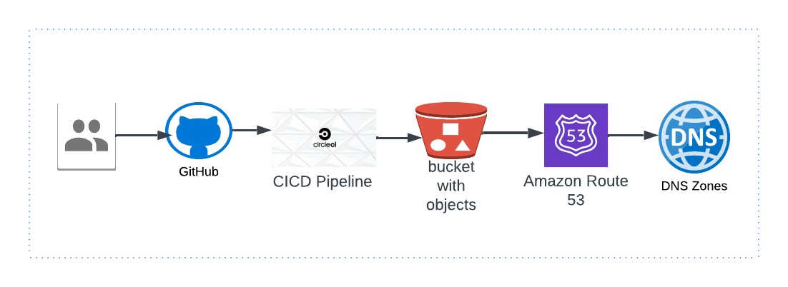

## :rocket: Running Personal Portfolio with CICD 
Building a personal website with  HTML, CSS and Javascript and running a pipeline with cicrleCi, AWS S3 Bucket and Route 53 for routing to DNS 

## CircleCi Status
[](https://dl.circleci.com/status-badge/redirect/gh/dev-luqman/Portfolio/tree/main)



### Documents
1. css / styling
2. img / images 
3. js / javascript
4. svg / icons
5. index.html / site root file

### CI CD Pipeline tools 
1. [CircleCi](https://circleci.com/)
2. [AWS](https://aws.amazon.com/)
  1. IAM with least access to only s3-bucket
  2. S3 Bucket - ``` expose for public access ```
  3. Route 53 - ``` optional ```


### Live Hosting At
[devLook](http://devlook.tech/)

### 'To Espect'
Would be Automating the site through using codebuild/codepipeline to s3-bucket and attach the domain name to R53 on aws
